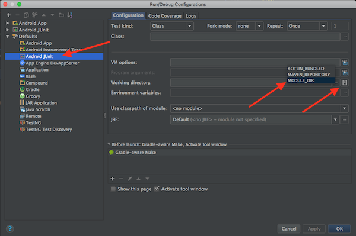

# BuddyBuild Android Client

### Test Path
We load .json files from disk during unit tests. When running tests from CL (e.g. `./gradlew test`) the path that the tests is run on is not the same as when running tests from *within* Android Studio. To fix this, we need to tell Android Studio to run tests from the module path for all Android JUnit tests:

